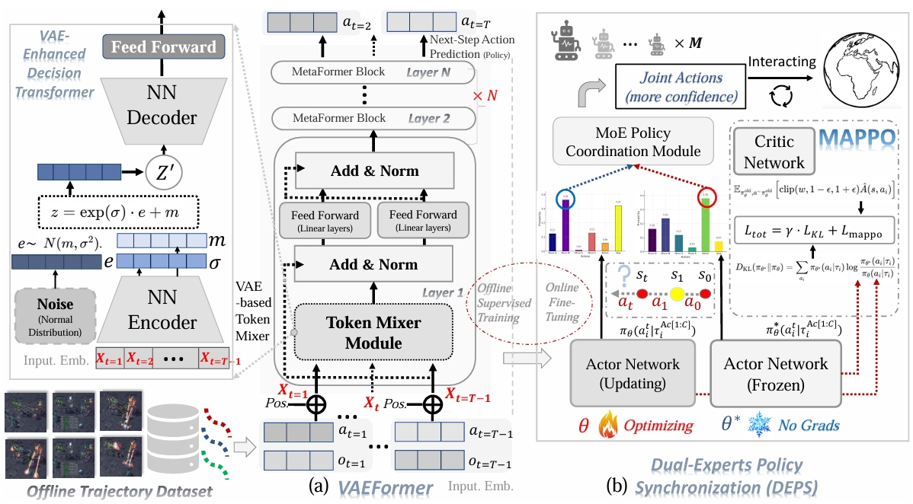
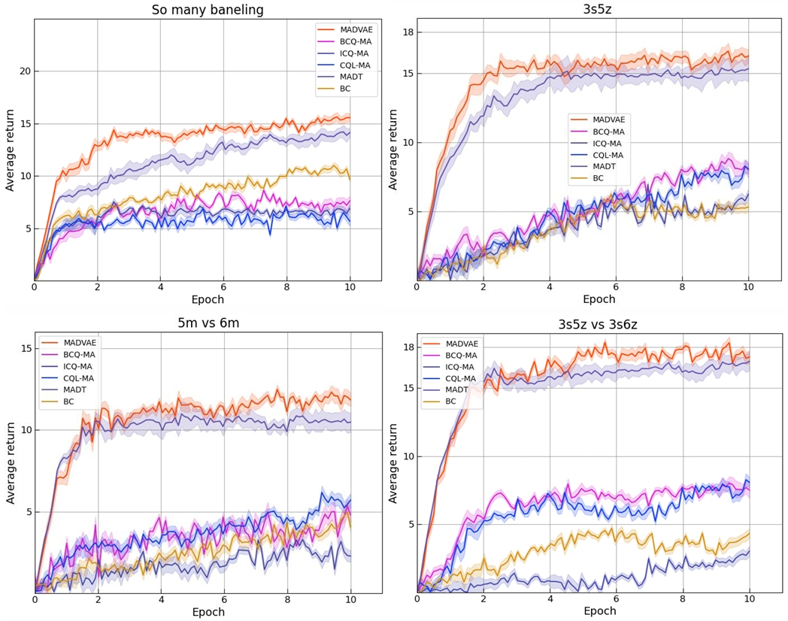

### MADVAE: Pre-Trained Multi-Agent Decision Transformer by Adopting Variational Autoencoder and Dual-Expert Policy Synchronization

[](https://opensource.org/licenses/MIT)
[](https://www.python.org/downloads/)
[](https://pytorch.org/)

Official implementation of our 
IEEE International Conference on Acoustics, Speech, and Signal Processing 2026 (ICASSP-26) submission:  
**"MADVAE: Pre-Trained Multi-Agent Decision Transformer by Adopting Variational Autoencoder and Dual-Expert Policy Synchronization"**
---
 Testbed on StarCraft II-like multi-agent micromanagement tasks - StarCraft Multi-Agent Challenge (SMAC)

[//]: # ([[Paper]]&#40;https://arxiv.org/abs/XXXX.XXXXX&#41; | )
[[Project Page]](https://github.com/SmileHappyEveryDay/MADVAE) | [[SMAC Benchmark]](https://github.com/oxwhirl/smac)

---
- Main Architecture of MADVAE
<p align="center">
  
</p>

---
## 🚀 Key Features
- **VAEFormer**: Novel Transformer variant integrating Variational Autoencoder into Decision Transformer architecture
- **DEPS**: Dual-Expert Policy Synchronization mechanism for offline-to-online transition
- **KL-Regularized Fine-tuning**: Maintains policy consistency during online adaptation
- **State-of-the-art performance** on StarCraft II Micromanagement (SMAC) benchmark
- **Robust OOD Generalization**: Superior handling of out-of-distribution states through VAE-enhanced modeling

---
## 🧩 Key Components
- **VAEFormer Architecture**: 
  - Replaces MHSA in Decision Transformer with VAE-based token mixer
  - Enhanced generalization for OOD scenarios through stochastic latent space
  - Improved temporal dependency modeling in POMDPs
- **DEPS Mechanism**: 
  - Confidence-based action selection between offline and online experts
  - KL-divergence regularization prevents catastrophic forgetting of offline knowledge
  - Synchronizes frozen offline expert with adaptive online policy
- **Two-Phase Learning**: 
  - Offline Training: Supervised imitation learning on expert trajectories
  - Online Fine-tuning: Policy optimization with dual-expert synchronization

---
## 📌 Installation

1. **Clone the repository**:
```bash
git clone https://github.com/SmileHappyEveryDay/MADVAE.git
cd MADVAE
```

2. **Install dependencies**:
```bash
pip install -r requirements.txt
bash install_sc2.sh
```

## 🏃 Quick Start

Run offline pre-training + online fine-tuning (offline-to-online) on 3s5z map:
```bash
python run_madt_sc2.py --map_name 3s5z --cuda_id 0
```

## 🏆 Performance

- Performance Comparisons of Online Fine-tuning
---
<p align="center">
  
</p>

- Offline Comparisons Between Baselines and MADVAE
---
<p align="center">
  
</p>

## 🛠️ Customization
Modify `sc2/models/gpt_model.py` to:
- Adjust VAE architectures
- Experiment with different token mixing strategies
- Tune KL-divergence regularization weights

Edit `sc2/framework/trainer.py` & `sc2/framework/rollout.py` to:
- Implement custom gating networks
- Modify expert selection strategies
- Adjust confidence thresholds

We also welcome contributions! Please open an issue or submit PRs for:
- Alternative policy coordination mechanisms
- Performance optimizations

---

## 📜 Citation
If you use this work, please cite:
```bibtex
@inproceedings{anonymous2025madvae,
  title={MADVAE: Pre-Trained Multi-Agent Decision Transformer by Adopting Variational Autoencoder and Dual-Expert Policy Synchronization},
  author={Anonymous et al.},
  booktitle={IEEE International Conference on Acoustics, Speech, and Signal Processing 2026 (ICASSP-26) (under review)},
  year={2025},
}
